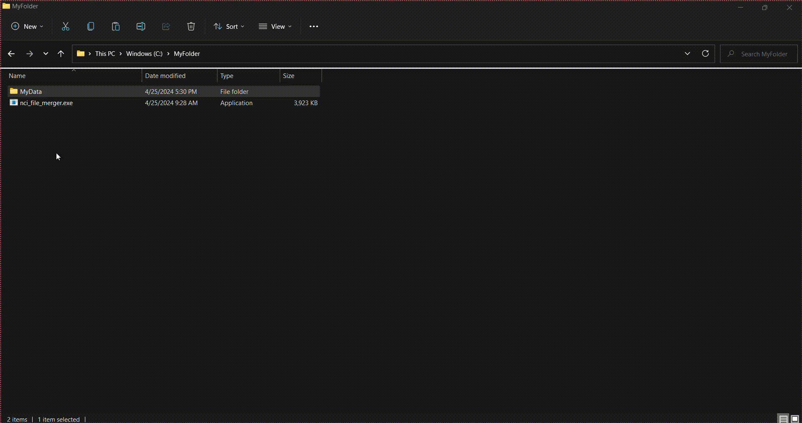

# NCI File Merger
A command-line utility written in Rust 🦀, designed to extract concentration and peak area data from files generated on the Agilent 5973 (NCI).

# 📖 Instructions for Use

1. Open Powershell and navigate to the directory containing the [downloaded](https://github.com/adamcseresznye/github_work_scripts/releases) `nci_file_merger.exe` executable. For example:  
   `cd "C:\Users\MyUserName\folder_nci_file_merger"`

2. Run the NCI File Merger command-line interface (CLI) with the desired parameters:  
   `.\nci_file_merger --path "C:\Users\MyUserName\folder_gc_files" --rows_to_skip_beginning 5 --rows_to_take 20`  
   In this example, `--path` specifies the root directory of the folder containing the data files.

3. Initially, you can adjust the desired parameters by setting the `--save` option to `false`. This will print the result to the terminal, allowing for quicker iteration to find the most optimal [parameters](https://github.com/adamcseresznye/github_work_scripts/tree/main/nci_file_merger#-options) (such as start and width of columns).

4. Once you're satisfied with the settings, you can save the results to CSV files by setting `--save` to `true`.

## 🤔 Available Options:
**Please Note**: A comprehensive list of available options can be obtained by executing `.\nci_file_merger --help`.
